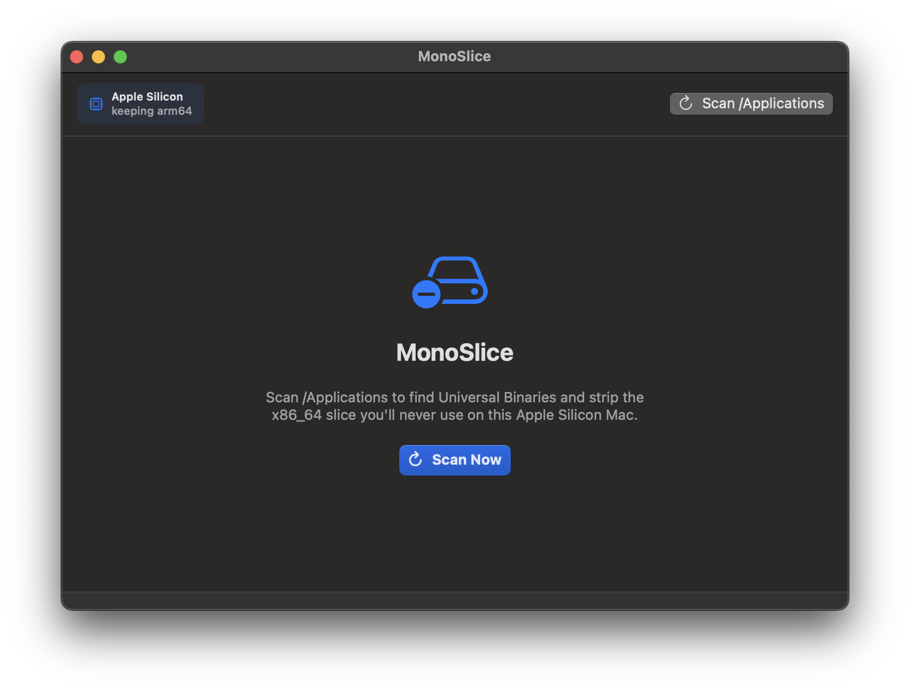
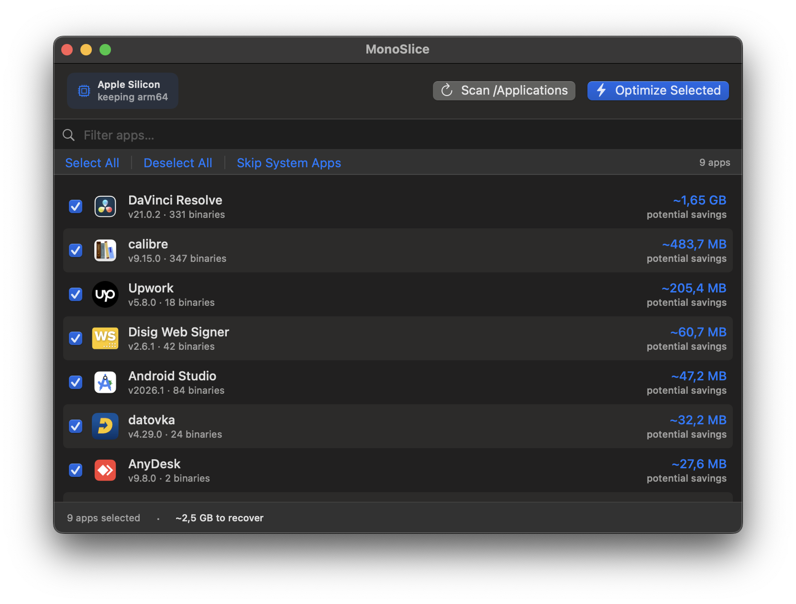
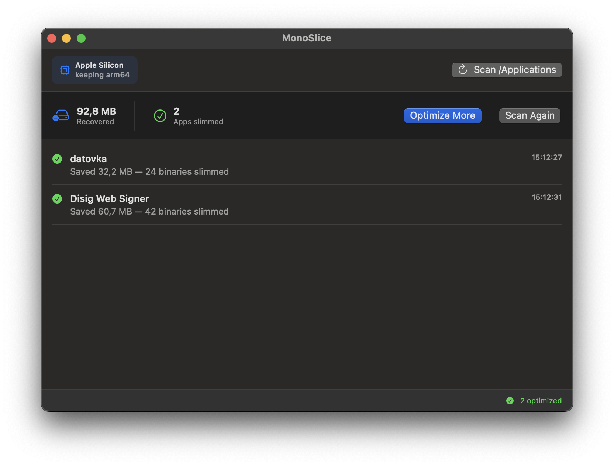

# MonoSlice

## Optimize your macOS applications

Remove unnecessary CPU architectures from macOS Universal Applications and reclaim valuable disk space.

MonoSlice removes unused Intel or Apple Silicon code from applications while keeping them fully functional.

MonoSlice is **free to use**, available as both a Mac app and a command-line tool (`monoslice`).

---

## Screenshots

**Scan `/Applications`** — MonoSlice detects your Mac's architecture and finds apps that carry the slice you don't need.



**Pick what to slim** — see the potential savings per app, select the ones you want and optimize them in one pass.



**See what you recovered** — a summary shows the space saved and how many apps were slimmed.



---

## Why MonoSlice?

Many macOS applications are distributed as **Universal Binaries**.

This means a single application can contain code for multiple processor architectures:

```text
Application.app

├── arm64        (Apple Silicon)
└── x86_64       (Intel)
```

If you are using only one type of Mac, part of this data is unnecessary.

MonoSlice removes the unused architecture slice and creates a smaller optimized application.

---

## Features

### Reduce application size

Remove unused CPU architectures and free up disk space.

Example:

**Before**

```text
Application size: 2.4 GB

Architectures:
✓ arm64
✓ x86_64
```

**After**

```text
Application size: 1.3 GB

Architecture:
✓ arm64
```

---

### Works with all Mac architectures

Supported processors:

- Intel Macs
- Apple Silicon Macs

Including:

- M1
- M2
- M3
- M4

---

### Batch scanning

Scan `/Applications` (or any folder) at once and select multiple apps to optimize in a single pass — no need to process apps one by one.

---

### Menu bar or Dock

Use MonoSlice as a regular Dock app, or enable **Settings → Keep MonoSlice in the menu bar** to keep it out of the way between scans.

---

### Bilingual interface

The Mac app is available in English and Russian.

---

### Privacy first

MonoSlice works completely offline.

Your applications and files never leave your Mac.

All processing happens locally on your computer.

---

## How it works

1. Detect the host architecture (`arm64` or `x86_64`), correctly handling Rosetta 2 so the architecture you actually need is never removed.
2. Scan the selected app (or folder of apps) for binaries that contain both the kept architecture and the one you don't need.
3. Clone the app bundle and remove the unneeded architecture in the clone, using `lipo`.
4. Re-sign the clone with an ad-hoc signature and verify it with `codesign`.
5. Swap the clone in for the original once it verifies. If anything fails along the way, the original app is left untouched.

Simple. Fast. Local.

---

## Installation

1. Download the latest MonoSlice release.
2. Open the DMG file.
3. Drag MonoSlice to the Applications folder.
4. Launch the application.

---

## Download

Download the latest version from GitHub Releases:

[Download MonoSlice](https://github.com/shaman-rostov/MonoSlice/releases)

---

## Compatibility

### macOS

Requires **macOS 12.0 Monterey or newer**, including:

- macOS 12 Monterey
- macOS 13 Ventura
- macOS 14 Sonoma
- macOS 15 Sequoia
- macOS 26 Tahoe

### Hardware

Supported:

- Intel Macs
- Apple Silicon Macs

---

## Safety

Removing an architecture invalidates an app's code signature, so MonoSlice must re-sign it. This has consequences worth knowing before you optimize:

- **Ad-hoc re-signing changes the app's identity.** macOS will ask you to re-grant permissions such as camera, microphone, and Full Disk Access, and existing Keychain items will re-prompt for access. MonoSlice warns you before optimizing an app.
- **Mac App Store apps are skipped.** Re-signing would invalidate their App Store receipt and they would refuse to launch.
- **System apps** (in `/System`, `/Library/Apple`, or with a `com.apple.*` identifier) are deselected by default; you can include them individually, with a warning.
- **Apps that need entitlements an ad-hoc signature can't keep are skipped** — App Sandbox, app groups, keychain groups, and similar. Re-signing would drop these, breaking the app's data access or features.
- The original app is never modified in place — MonoSlice works on a verified copy and only replaces the original once that copy is confirmed to launch correctly. If any step fails, the original app is left exactly as it was.

We still recommend keeping a backup copy of important applications. MonoSlice does not modify macOS system files.

---

## Bug Reports

Found an issue?

Create a GitHub Issue:

https://github.com/shaman-rostov/MonoSlice/issues

Please include:

- macOS version
- Mac model
- Application name
- Original application size
- Optimized application size
- Error message or screenshot

---

## Roadmap

Planned features:

- [ ] Finder Quick Action
- [ ] Automatic backups
- [ ] Detailed optimization reports

---

## Support MonoSlice

If MonoSlice helps you save disk space, consider supporting development.

Coming soon:

- GitHub Sponsors
- Buy Me a Coffee
- PayPal

---

## About MonoSlice

MonoSlice is a macOS utility designed to optimize Universal Applications by removing unnecessary CPU architectures.

MonoSlice is **free to use**. The Mac app and CLI share the same underlying engine. The application is distributed as closed-source software.

Documentation, downloads, and support are hosted through this GitHub repository.
