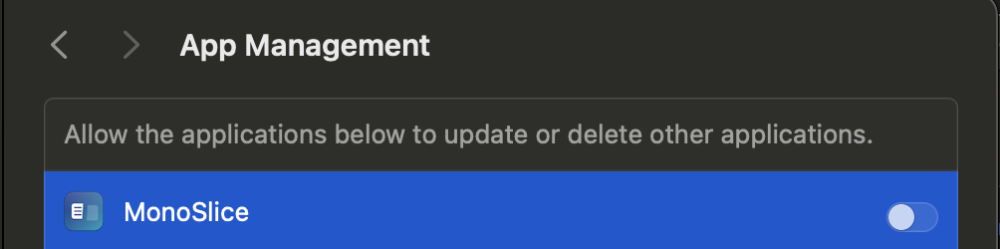

# Using MonoSlice

MonoSlice is designed to make optimizing macOS applications simple.

The entire process takes only a few steps.

---

## Before You Start

Before optimizing an application:

- Make sure the application is closed.
- Create a backup of important applications.
- Ensure you have enough free disk space for the optimized copy.

---

## Optimize an Application

### Step 1 — Select an Application

Open MonoSlice and choose the application you want to optimize.

You can:

- Drag and drop an application into MonoSlice.
- Select an application using the file picker.

Example:

```text
Applications
│
├── Blender.app
├── Chrome.app
├── Visual Studio Code.app
└── Other Apps...
```

---

### Step 2 — Application Analysis

MonoSlice analyzes the selected application and detects available architectures.

Example:

```text
Application:

Blender.app

Detected architectures:

✓ arm64
✓ x86_64

Current size:

2.4 GB
```

---

### Step 3 — Select Optimization

MonoSlice determines which architecture is unnecessary for your Mac.

Example:

On an Apple Silicon Mac:

```text
Keeping:

✓ arm64

Removing:

✗ x86_64
```

On an Intel Mac:

```text
Keeping:

✓ x86_64

Removing:

✗ arm64
```

---

### Step 4 — Create Optimized Application

MonoSlice creates a new optimized version of the application.

Example:

```text
Original:

Blender.app
Size: 2.4 GB


Optimized:

Blender.app
Size: 1.3 GB
```

---

## Batch Processing

MonoSlice scans a whole folder (by default, `/Applications`) in one pass and lists every app that has an architecture it can remove.

Select as many apps as you want and optimize them together — you don't need to process apps one at a time.

---

## Command-Line Usage

For scripting or one-off use, install the `monoslice` CLI:

```sh
monoslice /Applications/Firefox.app
monoslice /Applications --dry-run
monoslice ~/Downloads/MyApp.app --verbose
```

| Option | Description |
| --- | --- |
| `<path>` | A `.app` bundle, directory, or single binary to slim. |
| `--dry-run` | Preview changes without modifying any files. |
| `--verbose` / `-v` | Show a line for every file, including skipped ones. |
| `--keep-arch <arch>` | Architecture to keep (`arm64` or `x86_64`). Defaults to the host. |
| `--include-system` | Also slim Apple's own apps (skipped by default). |

---

## Restoring Applications

MonoSlice does not modify system applications automatically.

For important applications, keep a backup copy before optimization.

If you need the original Universal Binary again, reinstall the application from the official source.

---

## Checking Results

After optimization, verify that the application launches correctly.

Recommended checks:

- Open the application.
- Test your normal workflow.
- Check application functionality.

---

## Interface Language

The Mac app is available in English, Russian, German, Spanish, Polish and Czech.

By default (**Settings → Language → System**) MonoSlice uses the language set for it in **System Settings → General → Language & Region → Applications** (on macOS 12 Monterey: **System Preferences → Language & Region → Apps**), otherwise your macOS language. If that language isn't translated, it uses English.

To choose a language explicitly, open **Settings → Language** and pick one. The window switches right away, without closing open dialogs. Menus provided by macOS (Edit, Window, Quit…) switch after MonoSlice is relaunched.

---

## Troubleshooting

### Application does not start

Possible causes:

- The application was already damaged.
- The application requires multiple architectures.
- macOS security restrictions block execution.

Try:

1. Restore the original application.
2. Re-download the application.
3. Run MonoSlice again.

---

### Optimization fails with a permission error

On recent macOS versions, an app can only modify other apps if you allow it.

1. Open **System Settings → Privacy & Security → App Management**.
2. Turn on **MonoSlice**.
3. Run the optimization again.



---

### No space was saved

Some applications may contain:

- Only one architecture.
- Compressed resources.
- Large non-binary files.

In this case, removing architectures will not significantly reduce the size.

---

## Advanced Information

MonoSlice works with macOS Universal Binary applications.

Universal Binary structure:

```text
Application.app

└── Contents

    └── MacOS

        └── Executable

            ├── arm64 code
            └── x86_64 code
```

MonoSlice removes unused architecture data while preserving the remaining executable code.
